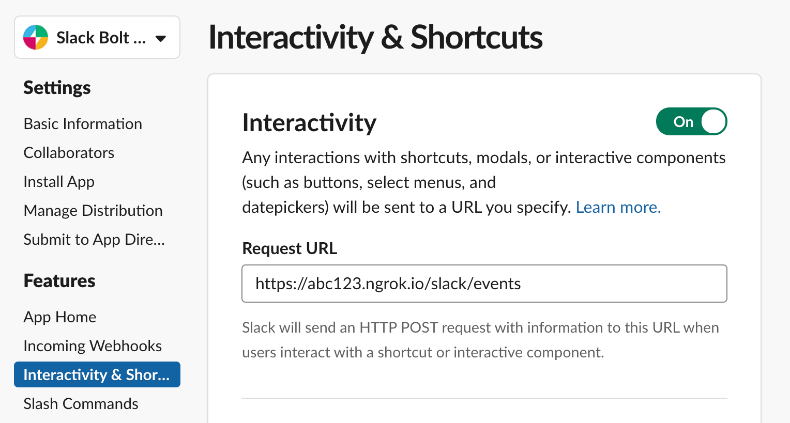
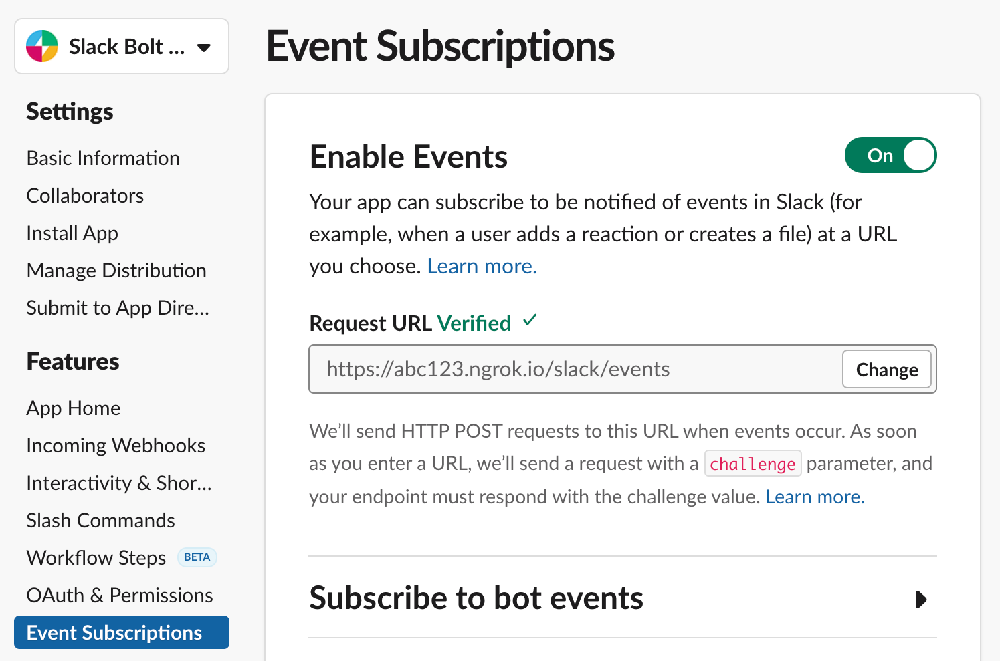

# Deploying to Heroku

<div class="section-content">
This guide will walk you through preparing and deploying a Slack app using [Bolt for JavaScript](/bolt-js) and the [Heroku platform](https://heroku.com/). Along the way, we’ll download a Bolt Slack app, prepare it for Heroku, and deploy it.
</div>

When you’re finished, you’ll have this ⚡️[Getting Started with Heroku app][getting-started-with-heroku-app] to run, modify, and make your own.

---

### Get a Bolt Slack app

If you haven't already built your own Bolt app, you can use our [Getting Started guide][getting-started-guide] or clone the template app below:

```shell
git clone https://github.com/slackapi/bolt-js-getting-started-app.git
```

After you have a Bolt app, navigate to its directory:

```shell
cd bolt-js-getting-started-app/
```

Now that you have an app, let's prepare it for Heroku.

---

### Prepare the app for Heroku

Heroku is a flexible platform that requires some configuration to host your app. In this section, we'll update your Bolt app to support Heroku.

**1. Use a Git repository**

Before you can deploy your app to Heroku, you'll need a Git repository. If you aren't already using Git, you'll need to [install Git](https://git-scm.com/book/en/v2/Getting-Started-Installing-Git) and [create a Git repository](https://git-scm.com/book/en/v2/Git-Basics-Getting-a-Git-Repository).

> 💡 Skip this step if you used `git clone` in the previous section because you already have a Git repository.

**2. Add a Procfile**

Every Heroku app uses a special file called `Procfile` that tells Heroku how to start your app. A Bolt Slack app will be started as a web server with a public web address.

Create a new file called `Procfile` (without any extension) in your app's root directory anad paste the following:

```yaml
web: node app.js
```

Once you've saved the file, let's commit it to your Git repository:

```shell
git add Procfile
git commit -m "Add Procfile"
```

> 💡 Are you following this guide with an existing Bolt app? If so, please review the guide on [preparing a codebase for Heroku](https://devcenter.heroku.com/articles/preparing-a-codebase-for-heroku-deployment#4-listen-on-the-correct-port) to listen on the correct port.

---

### Setup the Heroku tools

Now we can set up the Heroku tools on your local machine. These tools will help you manage, deploy, and debug your app on Heroku's platform.

**1. Install the Heroku CLI**

The Heroku tools are available as a Command Line Interface (CLI). Go ahead and [install the Heroku CLI for macOS, Windows, or Linux](https://devcenter.heroku.com/articles/getting-started-with-nodejs#set-up). On macOS, you can run the command:

```shell
brew install heroku/brew/heroku
```

Once the install is complete, we can test the Heroku CLI by displaying all of the wonderful commands available to you:

```shell
heroku help
```

> 💡 If the `heroku` command is not found, refresh your path by opening a new terminal session/tab.

**2. Log into the Heroku CLI**

The Heroku CLI connects your local machine with your Heroku account. [Sign up for a free Heroku account](https://heroku.com) and then log into the Heroku CLI with the following command:

```shell
heroku login
```
> 💡 If you're behind a firewall, you may need to [set the proxy environment variables](https://devcenter.heroku.com/articles/using-the-cli#using-an-http-proxy) for the Heroku CLI.

**3. Confirm you're logged into the Heroku CLI**

Check that you're logged in by displaying the account currently connected to your Heroku CLI:

```shell
heroku auth:whoami
```

You should now be set up with the Heroku tools! Let's move on to the exciting step of creating an app on Heroku.

---

### Create an app on Heroku

It’s time to [create a Heroku app](https://devcenter.heroku.com/articles/creating-apps) using the tools that you just installed. When you create an app, you can choose a unique name or have it randomly generated.

> 💡 You can [rename a Heroku app](https://devcenter.heroku.com/articles/renaming-apps) at any time, but you may change your Git remote and public web address.

**1. Create an app on Heroku**

Create an app on Heroku with a unique name:

```shell
heroku create my-unique-bolt-app-name
```

or, have some fun with a random name:

```shell
heroku create
# Creating sharp-rain-871... done, stack is heroku-18
# https://sharp-rain-871.herokuapp.com/ | https://git.heroku.com/sharp-rain-871.git
```

After your app is created, you'll be given some information that we'll use in the upcoming sections. In the example above:

- App name is `sharp-rain-871`
- Web address is `https://sharp-rain-871.herokuapp.com/`
- Empty Git remote is `https://git.heroku.com/sharp-rain-871.git`

**2. Confirm Heroku Git remote**

The Heroku CLI automatically adds a Git remote called `heroku` to your local repository. You can list your Git remotes to confirm `heroku` exists:

```shell
git remote -v
# heroku	https://git.heroku.com/sharp-rain-871.git (fetch)
# heroku	https://git.heroku.com/sharp-rain-871.git (push)
```

**3. Set environment variables on Heroku**

Now you'll need to add your Slack app credentials to your Heroku app: 

```shell
heroku config:set SLACK_SIGNING_SECRET=<your-signing-secret>
heroku config:set SLACK_BOT_TOKEN=xoxb-<your-bot-token>
```

> 💡 If you don't know where to find your credentials, please read about [exporting your signing secret and token](/bolt-js/tutorial/getting-started#tokens-and-installing-apps) in the Getting Started guide.

Now that we have prepared your local app and created a Heroku app, the next step is to deploy it!

---

### Deploy the app

To deploy the app, we're going to push your local code to Heroku, update your Slack app's settings, and say "hello" to your Heroku app. ✨

**1. Deploy the app to Heroku**

When deploying an app to Heroku, you'll typically use the `git push` command. This will push your code from your local repository to your `heroku` remote repository.

You can now deploy your app with the command:

```shell
git push heroku main
```

> 💡 Heroku deploys code that's pushed to the [master or main branches](https://devcenter.heroku.com/articles/git-branches). Pushing to other branches will not trigger a deployment.

Finally, we need to start a web server instance using the Heroku CLI:

```shell
heroku ps:scale web=1
```

**2. Update your Slack app's settings**

Now we need to use your Heroku web address as your **Request URL**, which is where Slack will send events and actions.

Get your Heroku web address with the following command:

```shell
heroku info
# ...
# Web URL: https://sharp-rain-871.herokuapp.com/
```

In our example, the web address is `https://sharp-rain-871.herokuapp.com/`.

Head over to the [Slack App page](https://api.slack.com/apps) and select your app name. Next, we'll update your **Request URL** in two locations to be your web address.

> 💡 Your **Request URL** ends with `/slack/events`, such as `https://sharp-rain-871.herokuapp.com/slack/events`.

First, select **Interativity & Shortcuts** from the side and update the **Request URL**:



Second, select **Event Subscriptions** from the side and update the **Request URL**:



> 💡 Free Heroku apps sleep when inactive. 💤 If your verification fails, please try it again immediately.

**3. Test your Slack app**

Your app is now deployed and Slack is updated, so let's try it out!

Open a Slack channel that your app has joined and say "hello" (lower-case). Just like in the [Getting Started guide](/bolt-js/tutorial/getting-started#sending-and-responding-to-actions), your app should respond back. If you don't receive a response, check your **Request URL** and try again.

---

### Deploy an update

As you continue building your Slack app, you'll need to deploy updates. A common flow is to make a change, commit it, and then push it to Heroku.

Let's get a feel for this by updating your app to respond to a "goodbye" message. Add the following code to `app.js` ([source code on GitHub](https://github.com/slackapi/bolt-js/blob/main/examples/getting-started-with-heroku/app.js)):

```javascript
// Listens to incoming messages that contain "goodbye"
app.message('goodbye', async ({ message, say }) => {
  // say() sends a message to the channel where the event was triggered
  await say(`See ya later, <@${message.user}> :wave:`);
});
```

Commit the changes to your local Git respository:

```shell
git commit -am "Say 'goodbye' to a person"
```

Deploy the update by pushing to your `heroku` remote:

```shell
git push heroku main
```

When the deploy is complete, you can open a Slack channel that your app has joined and say "goodbye" (lower-case). You should see a friendly farewell from your Slack app.

---

### Next steps

You just deployed your first ⚡️[Bolt for JavaScript app to Heroku][getting-started-with-heroku-app]! 🚀

Now that you've deployed a basic app, you can start exploring how to customize and monitor it. Here are some ideas of what to explore next:

- Brush up on [how Heroku works](https://devcenter.heroku.com/articles/how-heroku-works) and understand the [limitations of a free Heroku app](https://devcenter.heroku.com/articles/free-dyno-hours).
- Extend your app with [Bolt's Basic Concepts](/bolt-js/concepts#basic) and [Heroku's Add-ons](https://elements.heroku.com/addons).
- Learn about logging in [Bolt's Advanced Concepts](/bolt-js/concepts#logging) and how to [view log messages in Heroku](https://devcenter.heroku.com/articles/getting-started-with-nodejs#view-logs).
- Get ready for primetime with [how to scale your Heroku app](https://devcenter.heroku.com/articles/getting-started-with-nodejs#scale-the-app).

[getting-started-guide]: /bolt-js/tutorial/getting-started
[getting-started-with-heroku-app]: https://github.com/slackapi/bolt-js/tree/main/examples/getting-started-with-heroku
[getting-started-with-heroku-app]: https://github.com/slackapi/bolt-js/tree/main/examples/getting-started-with-heroku